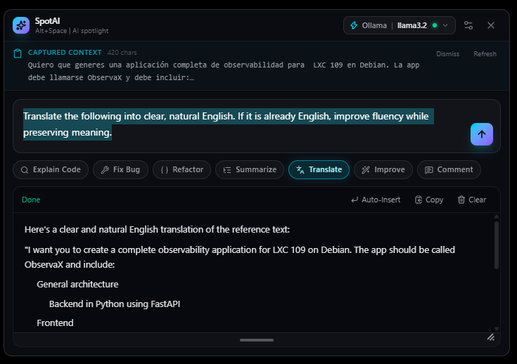

# SpotAI v1.2.0 🚀

> **The ultra-fast, Raycast-inspired AI Spotlight launcher for Windows.**  
> Access local LLMs (Ollama, LM Studio) or cloud models (OpenAI, Anthropic, OpenRouter, DeepSeek) anywhere with a single shortcut (`Alt + Space`).



[](https://buymeacoffee.com/jaimitus)
[](https://github.com/jaimitus/SpotAI/releases)
[](https://tauri.app)
[](https://www.rust-lang.org)
[](https://reactjs.org)
[](LICENSE)

---

## 🌟 What's New in v1.2.0

- 💬 **Multi-turn Chat with Memory**: Conversations persist between sessions — reopen SpotAI and continue where you left off, or start fresh with one-click **New chat**. History is trimmed smartly (last 20 turns / ~24k chars).
- 🔌 **Custom OpenAI-Compatible Providers**: Connect **any** endpoint — OpenRouter, Mistral, Together, vLLM… Add a name, base URL, optional API key (stored encrypted in Windows Credential Manager) and default model in Settings.
- 🚀 **Auto-start with Windows**: Launch SpotAI automatically at log-in with a single toggle (Settings → General).
- 🔄 **Signed Automatic Updates**: SpotAI checks GitHub Releases on startup and installs & restarts in one click via the Tauri updater — fully signed, no manual downloads.
- 📐 **Resizable Window with Memory**: Drag the bottom edge or corner to resize freely; the size is remembered between sessions.
- 🖱️ **Window Near Cursor**: The window opens beside your mouse cursor (Raycast-style), clamped to the monitor work area.
- ⚡ **Faster Boot**: Local-model health checks now time out in 2–3s instead of freezing startup for ~10s when servers are offline.
- 🌐 **100% Translated Interface**: Full i18n coverage in **English**, **Español** and **Deutsch** — Settings, model dropdown, copy buttons, onboarding and more.
- 📋 **Copy Code Blocks**: Every Markdown code block has a hover copy button.
- 🔍 **Smarter Model Picker**: Live search, full keyboard navigation (↑/↓/Enter), a refresh button and grouped local/cloud/custom sections.
- 🎓 **First-Run Onboarding**: A quick 3-step guide when no local models or API keys are configured yet.
- 🧪 **Unit Tests & CI**: Rust tests (providers, history bounding, credential masking) + Vitest (i18n completeness, prompts) and GitHub Actions CI/release workflows.

---

## 🗓️ What's New in v1.1.0

- 🌐 **Multi-Language i18n Support**:
  - Full interface translation in **English (Default)**, **Español (España)**, and **Deutsch (German)**.
  - Action prompt templates automatically adapt to your active display language so the AI responds in your preferred language.
- 🎛️ **Custom Prompt Action Buttons**:
  - Create and manage custom shortcut action buttons with your own prompt templates in Settings -> Custom Buttons tab.
  - Appears highlighted in amber for instant 1-click execution.
- 🔗 **Native External Browser Integration**:
  - Seamlessly launches external links & GitHub repository in your default system browser (Chrome/Edge/Firefox).

---

## 🔥 Key Features

- ⚡ **Instant Spotlight Access (`Alt + Space`)**: Summon SpotAI anywhere on your desktop in less than 100ms.
- 📋 **Automatic Clipboard Context Capture**: Selected text or copied code is automatically attached as context for instant explanation, refactoring, or translation.
- 🦙 **Ollama Local & Network Server Support**: Full compatibility with Ollama running locally or on a remote server/IP on your local network (e.g. `http://192.168.1.100:11434`).
- ☁️ **Multi-Provider Cloud AI**: Native support for **OpenAI**, **Anthropic (Claude)**, **Groq**, **DeepSeek**, plus local **LM Studio** — and **any OpenAI-compatible endpoint** (OpenRouter, Mistral, Together, vLLM…) with a custom base URL, API key and model.
- 🎯 **Native Auto-Insert (`Ctrl + Enter`)**: Insert AI responses directly into your active text editor, code editor, or browser with one click.
- 📐 **Dynamic Window Moving & Resizing**: Drag the title bar to position SpotAI anywhere, and resize it freely (drag the bottom edge or corner) — the size is remembered between sessions.
- 🔒 **Encrypted Storage**: Sensitive API keys are stored securely using the Windows Credential Manager.
- ⌨️ **Configurable Global Hotkey**: The `Alt + Space` shortcut can be changed to any combo (e.g. `Ctrl + Shift + Space`) from Settings.
- 🧠 **Custom System Prompt**: Define your own system prompt applied to every request, or keep SpotAI's built-in default.
- 💬 **Multi-turn Chat**: Conversations with memory, persisted between sessions, with a one-click "New chat".
- 🚀 **Auto-start with Windows**: Launch SpotAI automatically when you log in (toggle in Settings → General).
- 🔄 **Automatic Updates**: SpotAI checks GitHub Releases on startup and installs & restarts in one click (Tauri updater, signed).
- 📦 **Zero Heavy Dependencies**: Lightweight native Windows binary built with Tauri v2 and Rust.

---

## 🧪 Testing & CI

- **Unit tests**: `cargo test` covers provider parsing, history bounding, message formatting, host validation and credential masking; `npm test` (Vitest) covers i18n completeness across **en/es/de** and the action prompt templates.
- **Continuous Integration** (`.github/workflows/ci.yml`): typecheck, unit tests and production build on every push/PR.
- **Releases** (`.github/workflows/release.yml`): pushing a `vX.Y.Z` tag builds, signs and publishes a GitHub Release with the installers, `.sig` signatures and the `latest.json` updater manifest — no manual steps. Requires two repository secrets:
  - `TAURI_SIGNING_PRIVATE_KEY` — the content of `~/.tauri/spotai.key`
  - `TAURI_SIGNING_PRIVATE_KEY_PASSWORD` — the key password (leave empty when the key has none)

> ℹ️ The version is managed in a single place: `src-tauri/tauri.conf.json`. The frontend reads it at build time, so bumping the version there is enough for the installers and the in-app UI.

---

## 🎹 Keyboard Shortcuts

| Shortcut | Action |
| :--- | :--- |
| `Alt + Space` | Show / Hide SpotAI overlay *(configurable in Settings)* |
| `Esc` | Close / Hide SpotAI window |
| `Enter` | Submit prompt |
| `Shift + Enter` | Insert new line in prompt box |
| `↑ / ↓` | Navigate prompt history |
| `Ctrl + Enter` | Auto-insert the last response into the previous app |
| `Ctrl + ,` | Open Settings Modal |

---

## 🚀 Quick Download & Installation

Download the latest version from [GitHub Releases](https://github.com/jaimitus/SpotAI/releases/tag/v1.2.0):

- ⚡ **Standalone Executable**: `SpotAI.exe` (Run directly without installing)
- 📦 **Windows Installer**: `SpotAI-Setup.exe` or `SpotAI-Installer.msi`
- 🗂️ **Portable Package**: `SpotAI-Portable.zip`

*(All compiled release packages are stored in `dist_release/`)*

---

## 🛠️ Building from Source

### Prerequisites

- [Node.js](https://nodejs.org/) (v18+)
- [Rust](https://www.rust-lang.org/tools/install) (1.75+)
- Windows 10 / 11 Build Environment

### Installation Steps

1. **Clone the repository**:
   ```bash
   git clone https://github.com/jaimitus/SpotAI.git
   cd SpotAI
   ```

2. **Install frontend dependencies**:
   ```bash
   npm install
   ```

3. **Run in development mode**:
   ```bash
   npx tauri dev
   ```

4. **Build production binaries**:
   ```bash
   npx tauri build
   ```

### Publishing updates (auto-updater)

1. Generate the signing keypair once (keep the **private key secret**; the `.pub` file goes into `tauri.conf.json` → `plugins.updater.pubkey`):
   ```bash
   npx tauri signer generate -w ~/.tauri/spotai.key
   ```
2. Build and sign the update bundles (produces the `.sig` signatures next to the MSI/NSIS installers):
   ```bash
   export TAURI_SIGNING_PRIVATE_KEY="$(cat ~/.tauri/spotai.key)"
   export TAURI_SIGNING_PRIVATE_KEY_PASSWORD=""
   npx tauri build
   ```
3. **Publish a new GitHub Release** (e.g. push the `v1.2.0` tag — the `release.yml` workflow does everything automatically). The app checks `https://github.com/jaimitus/SpotAI/releases/latest/download/latest.json` on startup, so that file must exist as a release asset. Two ways to get it:
   - **Recommended:** use [`tauri-action`](https://github.com/tauri-apps/tauri-action) in the workflow — it builds, uploads the installers + `.sig` files and generates `latest.json` automatically.
   - **Manual:** upload the installers and their `.sig` files from `src-tauri/target/release/bundle/{msi,nsis}/`, then create `latest.json` with the static format and upload it too:
     ```json
     {
       "version": "1.2.0",
       "notes": "Release notes",
       "pub_date": "2026-01-01T00:00:00Z",
       "platforms": {
         "windows-x86_64": {
           "signature": "<content of the .sig file>",
           "url": "https://github.com/jaimitus/SpotAI/releases/download/v1.2.0/SpotAI_1.2.0_x64-setup.exe"
         }
       }
     }
     ```

---

## ☕ Support the Project

If you find SpotAI helpful, consider supporting its development:

[](https://buymeacoffee.com/jaimitus)

---

## 🏗️ Architecture

```
SpotAI
├── src-tauri/               # Native Rust Backend (Tauri v2)
│   ├── src/
│   │   ├── commands.rs      # Tauri API commands (Streaming, Ollama, Browser Launcher)
│   │   ├── native_input.rs  # Windows native input injection & paste (Ctrl+V)
│   │   ├── secure_store.rs  # Local DPAPI secure credential storage
│   │   └── lib.rs           # Window management, Tray icon & Global Hotkey
│   └── tauri.conf.json      # Tauri app configuration & capabilities
└── src/                     # React 19 Frontend
    ├── components/          # SpotlightWindow, ResponsePanel, SettingsModal, ActionChips
    ├── hooks/               # useLLMStream, useClipboardContext
    └── lib/                 # i18n, Prompts, Tauri API bridges, Providers
```

---

## 📄 License

This project is licensed under the [MIT License](LICENSE).

---

<p align="center">Crafted with ❤️ by <a href="https://github.com/jaimitus">jaimitus</a></p>
